# yt-gcc-pipeline

A serverless pipeline that collects the most popular YouTube videos in six GCC countries every day, adds category names, and publishes the result to a dashboard.

Live dashboard: https://yt-gcc-pipeline.streamlit.app

## What it does

At 21:00 Asia/Riyadh the pipeline calls the YouTube Data API for AE, BH, KW, OM, QA and SA. It writes one raw file per country to S3, joins them against a category lookup, and produces one flat file for the day. Athena reads that file and a Streamlit app charts it.

A normal day is around 830 chart rows and about 510 distinct videos. The gap exists because a lot of videos trend in more than one country.

## Architecture



## How the merge knows the batch is complete

S3 fires one event per object. It has no idea that six files belong together. If the merge Lambda listened to the raw prefix it would run six times a day, and each run would see a partial set. The invocations are async and unordered, so even counting files does not fix it. Two of them can read six files at the same moment and both proceed.

Instead, the ingest Lambda writes a seventh object once all six regions succeed:

```
raw/_control/youtube/most_popular/ingest_date=YYYY-MM-DD/_SUCCESS
```

The S3 notification is filtered on that key:

```
Prefix:  raw/_control/youtube/most_popular/
Suffix:  _SUCCESS
```

Filtering happens inside S3, so the six data writes never reach Lambda at all. The merge reads the body of `_SUCCESS`, which lists the exact keys written in that run. No `ListObjectsV2`, and no guessing which files belong to which batch.

If a region fails, `_SUCCESS` is never written. The merge does not run, and the incomplete day stays visible instead of being processed quietly.

The control prefix sits outside the table root so the Glue table only contains real partitions. The underscore in `_control` also keeps Glue, Spark and Athena from picking it up during partition discovery.

## Reliability

**Run guard.** Async delivery is at-least-once, so the same event can arrive twice. Before doing any work the merge writes one item to a DynamoDB table keyed on `ingest_date`, with `attribute_not_exists` as the condition. If the write succeeds it owns the batch. If DynamoDB rejects it, another invocation already has it and the function exits. The check and the claim are one atomic operation, which is what a plain read-then-write cannot give you.

Re-processing a day on purpose means deleting that item first.

**Dead-letter queue.** Lambda retries a failed async invocation twice and then drops the event. Anything that fails all three attempts goes to an SQS queue with 14 day retention instead, so the event survives and can be inspected.

**Alert.** A CloudWatch alarm watches the queue depth and publishes to an SNS topic when it goes above zero, which sends an email. Missing data is treated as good, because an empty queue reports no datapoints at all.

## Repository layout

```
yt-gcc-pipeline/
├── src/yt_gcc/
│   ├── config.py               regions, API URLs, table and key constants
│   ├── youtube.py              API calls and category merging
│   ├── storage.py              S3 read/write, key builders, run guard
│   ├── ingest_handler.py       daily ingest
│   ├── categories_handler.py   category lookup, run manually
│   └── merge_handler.py        join, flatten, write
├── scripts/
│   ├── build.sh                builds function.zip
│   └── deploy.sh               uploads it to all three functions
├── dashboard/
│   ├── app.py
│   └── requirements.txt
├── docs/
│   └── architecture.png
└── pyproject.toml
```

All three Lambdas share one zip. They differ only in the handler setting:

| Function | Handler |
|---|---|
| `yt-gcc-ingest` | `yt_gcc.ingest_handler.lambda_handler` |
| `yt-gcc-categories` | `yt_gcc.categories_handler.lambda_handler` |
| `yt-gcc-daily-merge` | `yt_gcc.merge_handler.lambda_handler` |

One package means `storage.py` and `config.py` cannot drift between functions, which is easy to do with separate packages and annoying to debug.

## S3 layout

```
yt-gcc-183749090090/
├── raw/
│   ├── _control/youtube/most_popular/ingest_date=YYYY-MM-DD/_SUCCESS
│   └── youtube/
│       ├── categories/fetched_date=YYYY-MM-DD/categories.ndjson
│       └── most_popular/region=XX/ingest_date=YYYY-MM-DD/<timestamp>.ndjson
└── processed/
    └── youtube/most_popular/ingest_date=YYYY-MM-DD/most_popular.ndjson
```

`raw/` keeps the API response as it arrived, with only `rank` and `pulled_at` added. `processed/` holds the flattened output. Keeping raw means the processed layer can be rebuilt with a different schema whenever needed.

Partition folders use `key=value` naming, which Athena reads natively.

## Processed schema

Fourteen columns, all flat. The nested `snippet` and `statistics` objects are unpacked, and fields with no analytical use are dropped: `kind`, `etag`, `description`, `thumbnails`, `localized`, `favoriteCount`.

| Column | Type | Source |
|---|---|---|
| `video_id` | string | `id` |
| `video_title` | string | `snippet.title` |
| `published_at` | string | `snippet.publishedAt` |
| `channel_id` | string | `snippet.channelId` |
| `channel_title` | string | `snippet.channelTitle` |
| `category_id` | string | `snippet.categoryId` |
| `category_name` | string | category lookup |
| `video_tags` | array\<string\> | `snippet.tags` |
| `view_count` | bigint | `statistics.viewCount` |
| `like_count` | bigint | `statistics.likeCount` |
| `comment_count` | bigint | `statistics.commentCount` |
| `regional_rank` | int | position in that country's chart |
| `pulled_at` | string | ingest timestamp |
| `region_code` | string | taken from the S3 key |

A few things worth knowing about the types:

Count fields arrive as strings and are cast to integers. When likes or comments are disabled on a video the field is missing, and it stays `NULL` rather than becoming `-1`, so Athena skips it in averages instead of counting it as a real value.

`video_tags` falls back to an empty list instead of `NULL`, which keeps the column type the same in every row.

Both timestamps are stored as strings. The API format ends in `Z`, which Athena's `timestamp` type does not parse, and it fails by returning `NULL` rather than raising an error. Queries convert with `from_iso8601_timestamp()` where they need to.

`regional_rank` only means something inside one country, so anything ranking-related has to group by `region_code` too.

## Athena

The table is external, so dropping it does not touch the files.

Partitions come from partition projection instead of the Glue Catalog. There is no `MSCK REPAIR TABLE` to run and a new day is queryable as soon as the file lands:

```sql
TBLPROPERTIES (
  'projection.enabled'='true',
  'projection.ingest_date.type'='date',
  'projection.ingest_date.range'='2026-09-01,NOW',
  'projection.ingest_date.format'='yyyy-MM-dd',
  'projection.ingest_date.interval'='1',
  'projection.ingest_date.interval.unit'='DAYS',
  'storage.location.template'='s3://.../most_popular/ingest_date=${ingest_date}'
)
```

`NOW` keeps the range open ended. This only works because the partition values follow a predictable pattern. Arbitrary partition names would still need the catalog.

## Dashboard

Streamlit on Streamlit Community Cloud, reading Athena through `awswrangler` with a read-only IAM user. The date sits in the page header, and everything except the History tab is scoped to that single partition.

The top row shows chart rows, unique videos, channels, median views and total views, each with the change against the previous collected day.

**Regions.** Category mix per country as percentages, because chart length is not the same everywhere. Saudi Arabia and the UAE return around 200 rows while Bahrain returns around 60, so raw counts would be misleading. Also chart size per country, a matrix of how many videos each pair of countries shares, and a split of exclusive against shared videos.

**Content.** Hours between publishing and trending by category, with mean and median. A heatmap of publishing hour in Riyadh time. Top tags, unnested from the array column and lowercased. Like rate against views on a log scale, with videos under 10k views excluded so small denominators do not produce silly ratios.

**Videos and channels.** Videos trending in more than one country, the top five in each country, the leading channels, and how much of the chart the ten biggest channels hold.

**History.** Unique videos and total views per day across every partition. This is the only view that scans all of them.

Results are cached for 30 minutes, and the date list for 5.

## Local development

```bash
uv sync
```

Build and deploy all three functions:

```bash
./scripts/build.sh && ./scripts/deploy.sh
```

`build.sh` installs dependencies for the Lambda platform rather than the local machine, removes `__pycache__`, and zips from inside the build directory so paths land at the package root.

Run the dashboard:

```bash
cd dashboard
streamlit run app.py
```

Secrets go in `dashboard/.streamlit/secrets.toml`, which is gitignored:

```toml
aws_access_key_id = "..."
aws_secret_access_key = "..."
aws_region = "us-east-1"
athena_database = "yt_gcc"
athena_output = "s3://.../"
```

## Configuration

Environment variables on `yt-gcc-ingest` and `yt-gcc-categories`:

| Variable | Purpose |
|---|---|
| `YOUTUBE_API_KEY` | YouTube Data API v3 key |
| `BUCKET_NAME` | target bucket |

**IAM.** Each Lambda has its own execution role. The merge role also needs `s3:PutObject` on the bucket, `dynamodb:PutItem` on the run guard table, and `sqs:SendMessage` on the dead-letter queue, all scoped to those specific resources.

The S3 trigger relies on a resource-based policy on the merge function, which is separate from its execution role. The execution role controls what the function can reach. The resource policy controls who is allowed to invoke it, and it is scoped by `SourceArn` and `SourceAccount`.

The dashboard uses a separate IAM user with Athena query execution, Glue catalog reads, S3 reads on the data bucket, and read/write on the Athena results bucket. It also needs `s3:GetBucketLocation` on both buckets, because Athena checks the bucket region before writing results. That one is easy to miss and the error message does not say so.

**Sizing.** The merge holds six regional files in memory at once, so 128 MB is not enough. 512 MB is comfortable, and because Lambda scales CPU with memory it also runs faster.

The categories function makes six sequential API calls and needs more than the default 3 second timeout. 30 seconds covers it.

## Design decisions

**A completion signal instead of counting files.** Counting through `ListObjectsV2` in each of six invocations is a race. Two of them can see six files at the same time and both continue, and fixing that needs an atomic claim in DynamoDB anyway. The signal file removes the concurrency instead of coordinating it, which is fewer parts and much easier to reason about at 2am.

**One category lookup, not one per country.** `videoCategories.list` is region scoped and the available IDs do differ slightly between countries. But an ID that appears in two countries always has the same title, so the mapping is global and one union table is enough. The join is on `category_id` alone.

**Categories fetched on demand.** They change maybe once a year. Pulling them daily would add six API calls and store the same rows over and over.

**NDJSON.** One object per line reads like a table, streams without loading the whole file, and works with Athena's `JsonSerDe` out of the box.

**21:00 local.** The chart builds up through the day, so an evening pull is more settled than a morning one. It also keeps the UTC `ingest_date` on the same calendar day as Riyadh. A run between midnight and 03:00 local would be stamped with the previous UTC date.

## Operational notes

Async invocations are at-least-once, which is what the run guard is for.

Bucket versioning is on, so re-runs add versions rather than overwriting. A lifecycle rule to expire old versions is worth adding as history grows.

The category lookup key is pinned in `config.py`. Running `yt-gcc-categories` again writes a new dated file, so that constant has to be updated and redeployed.