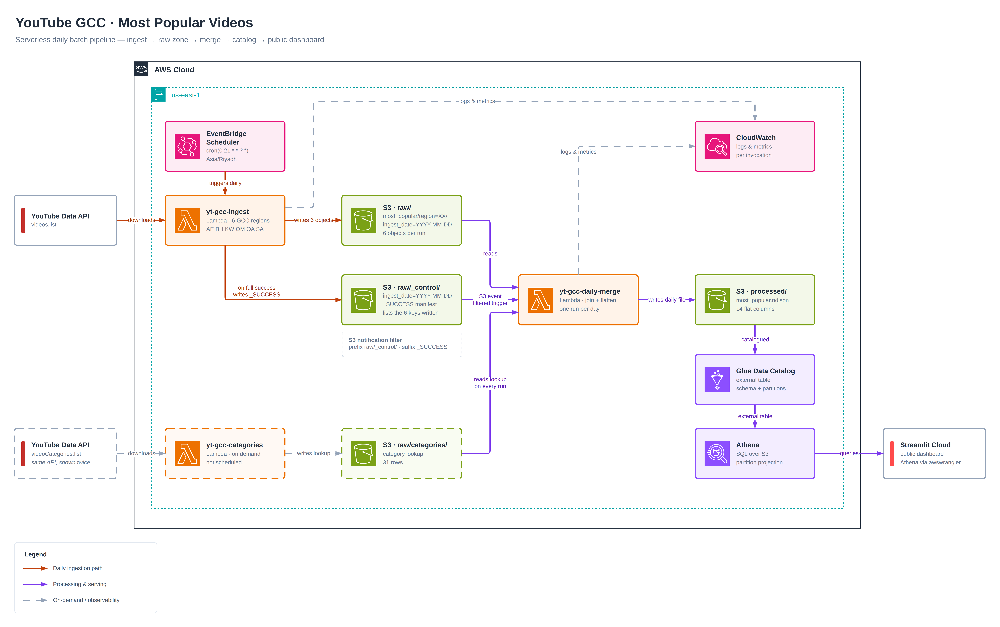

# yt-gcc-pipeline

A serverless daily data pipeline that collects the most popular YouTube videos across six GCC countries, enriches them with category names, and serves the result through a public dashboard.

**Live dashboard:** https://yt-gcc-pipeline.streamlit.app

---

## What it does

Every day at 21:00 Asia/Riyadh, the pipeline calls the YouTube Data API for six regions (AE, BH, KW, OM, QA, SA), writes one raw file per region to S3, joins the results against a category lookup, and produces a single flattened daily file that is queried by Athena and visualised in Streamlit.

A typical day produces around 800–850 chart rows covering roughly 500 distinct videos — the same video often trends in more than one country.

---

## Architecture



`yt-gcc-categories` runs separately and on demand. It writes the category lookup that the merge stage joins against.

---

## The completion-signal pattern

S3 emits one event per object written. It has no concept of a batch, so wiring the merge Lambda directly to the raw data prefix would invoke it six times a day — each invocation seeing an incomplete picture, with no ordering guarantee between them.

The pipeline solves this by having the ingest Lambda write a seventh object, `_SUCCESS`, as its final step and only when all six regions succeeded. The S3 event notification is filtered so that only that key triggers the merge:

```
Prefix:  raw/_control/youtube/most_popular/
Suffix:  _SUCCESS
```

Filtering happens inside S3 before delivery, so the six data writes generate no invocation at all. The merge Lambda then reads the `_SUCCESS` body, which contains the explicit list of the six keys written in that run — no `ListObjectsV2`, no guessing which files belong to which batch.

If any region fails, `_SUCCESS` is never written, the merge never runs, and the incomplete day stays visible rather than being silently processed.

The control prefix sits outside the table root (`raw/_control/…` rather than under `most_popular/`) so that the Glue table root contains only real partitions, and the leading underscore keeps Glue, Spark, and Athena from treating it as a partition during discovery.

---

## Repository layout

```
yt-gcc-pipeline/
├── src/yt_gcc/
│   ├── config.py               constants: regions, API URLs, categories key
│   ├── youtube.py              YouTube API calls and category merging
│   ├── storage.py              S3 read/write and key builders
│   ├── ingest_handler.py       Lambda 1 — daily regional ingest
│   ├── categories_handler.py   Lambda 2 — category lookup (on demand)
│   └── merge_handler.py        Lambda 3 — join, flatten, merge
├── scripts/
│   ├── build.sh                builds function.zip
│   └── deploy.sh               uploads the zip to all three functions
├── dashboard/
│   ├── app.py                  Streamlit app
│   └── requirements.txt
├── docs/
│   └── youtube-gcc-architecture.png
└── pyproject.toml
```

All three Lambdas share one deployment package. They differ only in the `Handler` setting:

| Function | Handler |
|---|---|
| `yt-gcc-ingest` | `yt_gcc.ingest_handler.lambda_handler` |
| `yt-gcc-categories` | `yt_gcc.categories_handler.lambda_handler` |
| `yt-gcc-daily-merge` | `yt_gcc.merge_handler.lambda_handler` |

One package means `storage.py` and `config.py` can never drift between functions, which is the failure mode that separate packages invite.

---

## S3 layout

```
yt-gcc-183749090090/
├── raw/
│   ├── _control/youtube/most_popular/ingest_date=YYYY-MM-DD/_SUCCESS
│   └── youtube/
│       ├── categories/fetched_date=YYYY-MM-DD/categories.ndjson
│       └── most_popular/region=XX/ingest_date=YYYY-MM-DD/<timestamp>.ndjson
└── processed/
    └── youtube/most_popular/ingest_date=YYYY-MM-DD/most_popular.ndjson
```

`raw/` holds API responses as received, enriched only with `rank` and `pulled_at`. `processed/` holds the flattened, merged output. Because raw is preserved, the processed layer can be regenerated with a different schema at any time.

Partition directories use Hive-style `key=value` naming, which Athena understands natively.

---

## Processed schema

Fourteen columns, all at one level. Nested `snippet` and `statistics` objects are flattened, and fields with no analytical value (`kind`, `etag`, `description`, `thumbnails`, `localized`, `favoriteCount`) are dropped.

| Column | Type | Source |
|---|---|---|
| `video_id` | string | `id` |
| `video_title` | string | `snippet.title` |
| `published_at` | string | `snippet.publishedAt` |
| `channel_id` | string | `snippet.channelId` |
| `channel_title` | string | `snippet.channelTitle` |
| `category_id` | string | `snippet.categoryId` |
| `category_name` | string | joined from category lookup |
| `video_tags` | array\<string\> | `snippet.tags` |
| `view_count` | bigint | `statistics.viewCount` |
| `like_count` | bigint | `statistics.likeCount` |
| `comment_count` | bigint | `statistics.commentCount` |
| `regional_rank` | int | position in the region's chart |
| `pulled_at` | string | ingest timestamp |
| `region_code` | string | derived from the S3 key |

Notes on typing:

- Count fields arrive from the API as strings and are cast to integers. Missing values (likes or comments disabled on a video) stay `NULL` rather than becoming `-1`, so Athena's aggregate functions skip them correctly.
- `video_tags` defaults to an empty list rather than `NULL`, keeping the column type stable across every row.
- Timestamps are stored as strings because the API's ISO-8601 format with a trailing `Z` does not parse into Athena's `timestamp` type — it would silently yield `NULL`. Queries convert with `from_iso8601_timestamp()` where needed.
- `regional_rank` is scoped to a single region, so any ranking analysis must group by `region_code` as well.

---

## Athena table

The table is external — dropping it never touches the underlying files.

Partitions use **partition projection** rather than the Glue Catalog, so no `MSCK REPAIR TABLE` is needed and each new day becomes queryable the moment the file lands:

```sql
TBLPROPERTIES (
  'projection.enabled'='true',
  'projection.ingest_date.type'='date',
  'projection.ingest_date.range'='2026-09-01,NOW',
  'projection.ingest_date.format'='yyyy-MM-dd',
  'projection.ingest_date.interval'='1',
  'projection.ingest_date.interval.unit'='DAYS',
  'storage.location.template'='s3://.../most_popular/ingest_date=${ingest_date}'
)
```

`NOW` makes the range self-extending. Projection works here because the partition values follow a predictable pattern; it would not suit arbitrary partition names.

---

## Dashboard

Streamlit app deployed on Streamlit Community Cloud, reading from Athena through `awswrangler` with a dedicated read-only IAM user. A sidebar selects the ingest date and filters regions; every view except the history tab is scoped to a single partition.

**Headline metrics** — chart rows, distinct videos, distinct channels, median views, and the share of videos trending in more than one country.

**Regions**

- Category mix per country, normalised to percentages since chart length varies (Saudi Arabia and the UAE return around 200 rows, Bahrain around 60).
- Chart size and total reach per country.
- Overlap matrix — how many videos each pair of charts shares.
- Local versus regional split — videos exclusive to one chart against those trending in several.

**Content**

- Hours to trend by category, with both mean and median.
- Publication-hour heatmap in Riyadh time for the leading categories.
- Top tags, `UNNEST`ed from the array column and case-normalised.
- Engagement scatter — like rate against views on a log scale, coloured by category, filtered to videos above 10k views so small denominators do not distort the ratio.

**Videos & channels**

- Cross-border videos with the countries they appear in and their best rank.
- The top five entries in each selected country.
- Leading channels, plus the share of all chart positions held by the ten largest.

**History** — daily unique videos and total views across every partition produced so far. This is the only view that reads all partitions rather than one.

Query results are cached with a TTL, and a sidebar button clears the cache for an immediate refresh.

---

## Local development

```bash
uv sync
```

Build and deploy all three Lambdas:

```bash
./scripts/build.sh && ./scripts/deploy.sh
```

`build.sh` installs dependencies for the Lambda platform (`x86_64-manylinux2014`) rather than the local machine's architecture, strips `__pycache__`, and zips from inside the build directory so paths resolve at the package root.

Run the dashboard locally:

```bash
cd dashboard
streamlit run app.py
```

Secrets live in `dashboard/.streamlit/secrets.toml`, which is gitignored:

```toml
aws_access_key_id = "..."
aws_secret_access_key = "..."
aws_region = "us-east-1"
athena_database = "yt_gcc"
athena_output = "s3://.../"
```

---

## Configuration

**Lambda environment variables** (`yt-gcc-ingest`, `yt-gcc-categories`):

| Variable | Purpose |
|---|---|
| `YOUTUBE_API_KEY` | YouTube Data API v3 key |
| `BUCKET_NAME` | Target S3 bucket |

**IAM**

Each Lambda has its own execution role. The merge role additionally needs `s3:PutObject` on the bucket, granted through an inline policy scoped to `arn:aws:s3:::<bucket>/*` rather than a broad managed policy.

The S3 → Lambda trigger relies on a resource-based policy on the merge function itself, separate from its execution role: the execution role governs what the function can reach, while the resource policy governs who may invoke it. It is scoped by `SourceArn` and `SourceAccount`.

The dashboard uses a separate IAM user limited to Athena query execution, Glue catalog reads, S3 reads on the data bucket, and read/write on the Athena results bucket. `s3:GetBucketLocation` is required on both buckets — Athena verifies bucket regions before writing results.

**Sizing**

The merge function holds all six regional files in memory at once and needs more than the 128 MB default; 512 MB gives comfortable headroom. Since Lambda scales CPU with memory, the increase also shortens execution time.

The categories function makes six sequential API calls and exceeds the default 3-second timeout; 30 seconds is sufficient.

---

## Design decisions

**Why a completion signal instead of counting files.** Counting via `ListObjectsV2` on each of the six invocations creates a race: two concurrent invocations can both observe six files and both proceed. Fixing that requires an atomic check-and-claim in DynamoDB. The signal file removes the concurrency altogether rather than coordinating it — fewer moving parts, and easier to reason about when something breaks.

**Why one category lookup rather than one per region.** `videoCategories.list` is region-scoped, and the available IDs do differ slightly between countries. But an ID that appears in two regions always carries the same title, so the mapping is global and a single union table is sufficient. The join is on `category_id` alone.

**Why the category file is written on demand.** Categories change perhaps once a year. Fetching them daily would add six API calls and duplicate storage for data that does not move.

**Why NDJSON.** One JSON object per line reads naturally as a table, streams without loading the whole file, and is directly supported by Athena's `JsonSerDe`.

**Why 21:00 local.** The most-popular chart accumulates through the day, so an evening pull captures a more settled picture than an early-morning one. It also keeps the UTC-computed `ingest_date` aligned with the local calendar day — a run between midnight and 03:00 Riyadh time would be stamped with the previous UTC date.

---

## Operational notes

- Lambda invocations from S3 are asynchronous and delivered at-least-once. Processing should stay idempotent.
- Failed async invocations are retried twice, then dropped unless a dead-letter queue is configured.
- Bucket versioning is enabled, so re-runs create new versions rather than overwriting. A lifecycle rule to expire old versions is worth adding as history grows.
- The category lookup key is pinned in `config.py`. Re-running `yt-gcc-categories` writes a new dated file, which requires updating that constant and redeploying.

---

## Roadmap

- Fail the ingest Lambda on any partial region failure, not only when all six fail
- Dead-letter queue for the merge function
- Idempotency guard keyed on ingest date
- Rank churn and day-over-day movement once enough history accumulates
- Convert the processed layer to Parquet as volume grows