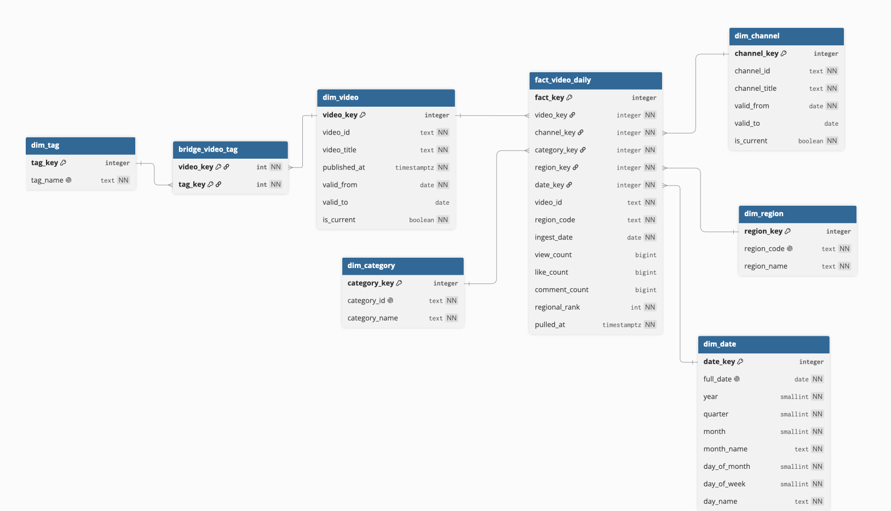

# YouTube GCC Warehouse

A dimensional warehouse built on top of the daily YouTube most-popular data collected for six GCC countries, loaded into PostgreSQL and orchestrated with Airflow.

The upstream pipeline writes one processed NDJSON file per day to S3. This part of the project models that data as a star schema, tracks history on the dimensions that change, and runs the whole load as a single daily DAG.



## Source data

One file per day, partitioned by date in the key:

```
s3://<bucket>/processed/youtube/most_popular/ingest_date=YYYY-MM-DD/most_popular.ndjson
```

Each line is one JSON object representing one video appearing in one country's most-popular list on one day. A typical day holds around 900 rows covering roughly 500 distinct videos, the gap being videos that chart in more than one country.

Three details of the source shape the design. The three counters are cumulative totals since publication rather than daily figures, and they are global to the video rather than per country. Video tags arrive as an array, empty rather than null when a video has none. The ingest date is not inside the file at all, only in the S3 key, so it is attached during the load.

## Design

**The event being measured** is a video appearing in a country's most-popular list. The source only contains those lists, so nothing else is measurable from it. The fact table therefore records appearances and nothing else, and a video dropping off the list simply has no row for that day.

**One fact row** is one video, in one region, on one ingest date. The ingest date is used rather than the collection timestamp because the collection timestamp differs by a few seconds between countries inside the same run, and every row of one run has to share one date for the history logic to work.

**Dimensions do not reference each other.** All relationships pass through the fact table, which keeps every question one join away.

**History is kept where an analysis needs it, not wherever change is possible.** Video titles and channel titles are versioned, because publishers edit titles shortly after publishing, which is exactly the window when a video is charting, and comparing performance before and after a retitle is the point. Categories and tags are overwritten in place, since nothing depends on their earlier values. Regions and the calendar are seeded once with the DDL rather than derived from the daily file, since both are known in advance.

**Every dimension has a generated integer surrogate key**, including the ones without history. This keeps the fact table structure independent of dimension policy, so converting a dimension to versioned later touches only that dimension instead of altering a column in the largest table. Source identifiers stay in the dimensions as ordinary text columns and are never converted to numbers, since they are identifiers rather than quantities.

**The fact table also keeps the natural key** (`video_id`, `region_code`, `ingest_date`) and carries the unique constraint on those three columns rather than on the surrogate keys. Surrogate keys of a versioned dimension move: if a day is reloaded after a title change, the lookup returns a different `video_key`, a constraint built on surrogate keys sees a new combination and admits a duplicate row. Source identifiers do not move, so the constraint holds.

**Tags use a bridge table**, since a video has many tags and a tag belongs to many videos. The cost is that joining the fact table through the bridge multiplies rows by tag count, so aggregating the counters across tags double counts unless the query handles it.

### Measures

| Column | Additivity | Valid aggregation |
|---|---|---|
| `view_count` | semi-additive | across different videos within one day and one region |
| `like_count` | semi-additive | same |
| `comment_count` | semi-additive | same |
| `regional_rank` | non-additive | none |

The counters are cumulative and global, so summing across days double counts and summing across regions counts the same value once per region. Last value in a period, or the difference between two days, are the correct operations. Rank is a position, so ordering, filtering and counting are the only things that mean anything.

## The load

Nine tasks, in dependency order:

```
check_file        the day's key exists in S3
download_file     pull it to a date-partitioned local folder
load_raw          COPY the lines into a jsonb landing table
load_staging      parse the JSON into typed columns
load_dim_type1    categories and tags
load_dim_type2    channels and videos, close then open
load_bridge       video to tag links
load_fact         resolve every identifier to a surrogate key
run_checks        quality gates
```

`load_dim_type1` and `load_dim_type2` have no dependency on each other and run in parallel. The bridge follows the versioned dimensions because it needs `video_key`. The fact table is last because its foreign keys point at everything before it.

All transform logic is SQL under `load/`, parameterised with `{{ ds }}`, so Airflow is only the runner.

### Re-running

Every stage is safe to re-run for the same day. The staging tables are reset at the start of the load, the Type 1 dimensions use conflict handling, the bridge deletes the day's video links before reinserting, and the fact table deletes the day's rows before inserting. The versioned dimensions need no deletion: after the first run, nothing has changed, so the close statement matches nothing and the insert finds every entity already current.

### Versioned dimension logic

Three cases per incoming row. A new entity is inserted as current. An unchanged entity is left alone. A changed entity has its current row closed and a new row opened.

Both the closing date and the opening date are the ingest date, so the periods meet exactly with no gap and no overlap. A gap means a lookup finds no version and the fact row is dropped. An overlap means it finds two and the row is duplicated. The date comes from the file rather than from the current date, so backfilling a past day records the change on the day it actually happened.

The close and the open run inside one transaction. Without that, a failure between them leaves an entity with no current row at all.

A partial unique index enforces one current row per natural key, which catches a broken close before it corrupts anything.

### Quality checks

Two gates, both of which raise an exception so the task fails visibly rather than passing bad data through.

The first compares the staging row count with the fact row count for the day. The join that resolves identifiers to surrogate keys drops rows silently when it finds no match, so without this check a missing dimension row would quietly shrink the day's data.

The second looks for any entity with more than one current row in the versioned dimensions, which would mean the close step is broken.

## Running it locally

Two compose projects, joined by a shared Docker network so Airflow reaches the database by service name.

```
docker network create yt_shared
cd warehouse  && docker compose up -d
cd airflow    && docker compose up airflow-init && docker compose up -d
```

Create the schema and seed the static dimensions:

```
docker compose exec -T warehouse psql -U <user> -d warehouse < ddl/01_schemas.sql
docker compose exec -T warehouse psql -U <user> -d warehouse < ddl/02_staging.sql
docker compose exec -T warehouse psql -U <user> -d warehouse < ddl/03_dimensions.sql
docker compose exec -T warehouse psql -U <user> -d warehouse < ddl/04_seed_static.sql
docker compose exec -T warehouse psql -U <user> -d warehouse < ddl/05_raw_landing.sql
```

Every DDL file is safe to run twice.

Then add two Airflow connections:

| Connection | Type | Notes |
|---|---|---|
| `warehouse_db` | Postgres | host `warehouse`, port `5432`, the internal port, not the published one |
| `aws_s3_conn` | AWS | keys for a read-only IAM user |

The warehouse publishes `5433` on the host for pgAdmin. Airflow does not use it, since container traffic never leaves the Docker network.

The S3 credentials belong to an IAM user in a separate AWS account from the bucket, which needs permission on both sides: a policy on the user granting `s3:GetObject` and `s3:ListBucket`, and a bucket policy on the owning account authorising that user. Either one alone is not enough.

Airflow UI on `localhost:8080`.

## Layout

```
warehouse/
  docker-compose.yml
  ddl/          schema, tables, static seeds, run once
  load/         daily transforms, parameterised by date
  data/         downloaded files, partitioned by ingest date
  docs/
  airflow/
    docker-compose.yaml
    dags/yt_warehouse.py
```

`ddl` and `load` are separate because the first runs once when the database is built and the second runs every day.

## Known limits

Change detection compares the incoming snapshot against stored state, so it sees the situation at collection time only. A title changed twice between two files shows up as one change.

The load cannot run two days at once. The staging tables hold a single day by definition, and out-of-order runs would interleave validity periods in the versioned dimensions. `max_active_runs=1` is a correctness requirement here, not a performance setting.

The bridge table holds latest state with no history, so tag changes overwrite rather than version.

Failure alerting is not configured yet, so failures are visible in the UI but are not pushed anywhere.

Everything runs locally. Moving Airflow to a server, with an instance role in place of stored credentials, is the next step.

## State after backfill

27 days loaded, 23,266 fact rows. Across that window, 65 video versions and 3 channel versions were closed and replaced, which matches the assumption behind versioning both: titles move far more often than channel names.